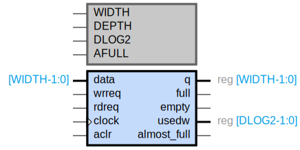

## Synchronous FIFO

### Symbol

### General Description
The Synchronous FIFO (First-In-First-Out) module is designed to manage data flow between two systems operating at the same clock frequency. It provides a buffer to store data temporarily, ensuring smooth data transfer without loss or overflow.

### Code
The code for the FIFO may be found at TODO

### Features
- Width: Configurable data width (default: 32 bits)
- Depth: Configurable FIFO depth (default: 8 entries)
- Almost Full Threshold: Configurable threshold for almost full status (default: 3 entries)
- Asynchronous Clear: Reset functionality to clear the FIFO

### Parameters
- WIDTH: Data width (default: 32)
- DEPTH: FIFO depth (default: 8)
- DLOG2: Log base 2 of the depth (default: 3)
- AFULL: Almost full threshold (default: 3)

### Inputs
- data [WIDTH-1:0]: Data input to the FIFO
- wrreq: Write request signal
- rdreq: Read request signal
- clock: Clock signal
- aclr: Asynchronous clear signal

### Outputs
- q [WIDTH-1:0]: Data output from the FIFO
- full: Full status signal
- empty: Empty status signal
- usedw [DLOG2-1:0]: Number of used words in the FIFO
- almost_full: Almost full status signal

### Functional Description
- Write Operation: Data is written to the FIFO on the rising edge of the clock when wrreq is asserted. The write address (wr_addr) increments with each write operation.
- Read Operation: Data is read from the FIFO on the rising edge of the clock when rdreq is asserted. The read address (rd_addr) increments with each read operation.
- Asynchronous Clear: When aclr is asserted, the FIFO is cleared, resetting the write and read addresses, and the used word count (usedw).

### Status Signals
- Full: Asserted when the FIFO is full.
- Empty: Asserted when the FIFO is empty.
- Almost Full: Asserted when the number of used words exceeds the almost full threshold.

### Internal Registers
- ram [DEPTH-1:0]: Memory array to store FIFO data
- wr_addr [DLOG2-1:0]: Write address pointer
- rd_addr [DLOG2-1:0]: Read address pointer
